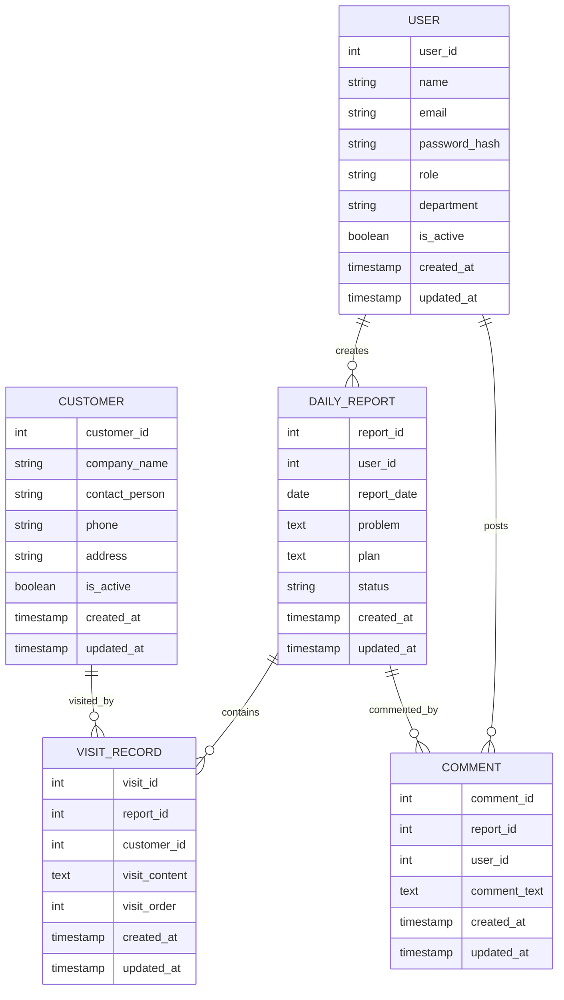

# 営業日報システム ER図

**バージョン:** 1.0
**作成日:** 2026-03-27

---

## エンティティ定義

### USER（ユーザーマスター）

| カラム名 | 型 | 制約 | 説明 |
|---|---|---|---|
| user_id | INT | PK, AUTO_INCREMENT | ユーザーID |
| name | VARCHAR(100) | NOT NULL | 氏名 |
| email | VARCHAR(255) | NOT NULL, UNIQUE | メールアドレス（ログインID） |
| password_hash | VARCHAR(255) | NOT NULL | パスワードハッシュ |
| role | ENUM | NOT NULL | SALES / MANAGER / ADMIN |
| department | VARCHAR(100) | | 部署名 |
| is_active | BOOLEAN | NOT NULL, DEFAULT TRUE | 有効フラグ |
| created_at | TIMESTAMP | NOT NULL | 作成日時 |
| updated_at | TIMESTAMP | NOT NULL | 更新日時 |

### CUSTOMER（顧客マスター）

| カラム名 | 型 | 制約 | 説明 |
|---|---|---|---|
| customer_id | INT | PK, AUTO_INCREMENT | 顧客ID |
| company_name | VARCHAR(200) | NOT NULL | 会社名 |
| contact_person | VARCHAR(100) | | 担当者名 |
| phone | VARCHAR(20) | | 電話番号 |
| address | VARCHAR(500) | | 住所 |
| is_active | BOOLEAN | NOT NULL, DEFAULT TRUE | 有効フラグ |
| created_at | TIMESTAMP | NOT NULL | 作成日時 |
| updated_at | TIMESTAMP | NOT NULL | 更新日時 |

### DAILY_REPORT（日報）

| カラム名 | 型 | 制約 | 説明 |
|---|---|---|---|
| report_id | INT | PK, AUTO_INCREMENT | 日報ID |
| user_id | INT | FK(USER), NOT NULL | 作成者 |
| report_date | DATE | NOT NULL | 日報の日付 |
| problem | TEXT | | 今の課題・相談 |
| plan | TEXT | | 明日やること |
| status | ENUM | NOT NULL, DEFAULT 'DRAFT' | DRAFT / SUBMITTED |
| created_at | TIMESTAMP | NOT NULL | 作成日時 |
| updated_at | TIMESTAMP | NOT NULL | 更新日時 |

- **一意制約:** `(user_id, report_date)`

### VISIT_RECORD（訪問記録）

| カラム名 | 型 | 制約 | 説明 |
|---|---|---|---|
| visit_id | INT | PK, AUTO_INCREMENT | 訪問記録ID |
| report_id | INT | FK(DAILY_REPORT), NOT NULL | 日報ID |
| customer_id | INT | FK(CUSTOMER), NOT NULL | 顧客ID |
| visit_content | TEXT | NOT NULL | 訪問内容 |
| visit_order | INT | NOT NULL, DEFAULT 1 | 訪問順序 |
| created_at | TIMESTAMP | NOT NULL | 作成日時 |
| updated_at | TIMESTAMP | NOT NULL | 更新日時 |

### COMMENT（コメント）

| カラム名 | 型 | 制約 | 説明 |
|---|---|---|---|
| comment_id | INT | PK, AUTO_INCREMENT | コメントID |
| report_id | INT | FK(DAILY_REPORT), NOT NULL | 日報ID |
| user_id | INT | FK(USER), NOT NULL | 投稿者（上長） |
| comment_text | TEXT | NOT NULL | コメント本文 |
| created_at | TIMESTAMP | NOT NULL | 作成日時 |
| updated_at | TIMESTAMP | NOT NULL | 更新日時 |

---

## ER図

